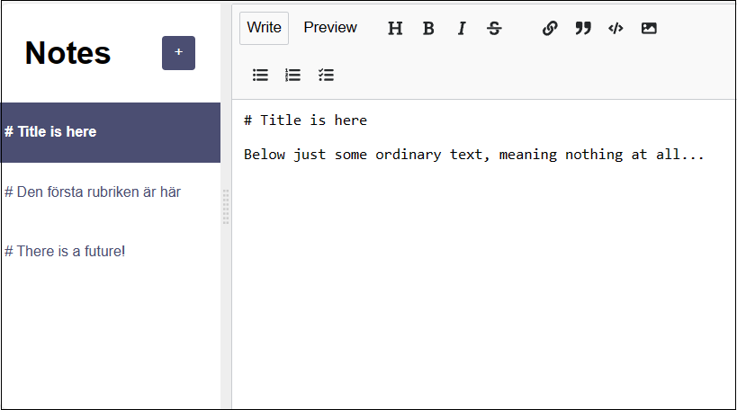

# Notes App

## Description
An app where you can write your own notes and format the texts with markup tags. If you click the Preview button at the top you will see the markup appearance!

In this version the notes are stored in localstorage which means they are only stored in your local browser. In this way nobody but you will see your notes! I have another version which stores to database, but that version is not deployed anywhere.

Because of dependencies in the markup package `react-mde` I had to downgrade to React 17.0.2 (instead of 18.2.0).
 
 

## Technologies
- HTML
- CSS
- JavaScript
- React

## Live link
The app is deployed here:
[https://markup-notes.netlify.app](https://markup-notes.netlify.app)

Please feel free to play around with the app!

## What I learned
There was already a start version of this project in course [Frontend Developer Career Path](https://scrimba.com/learn/frontend) and the exercise here was to add the following new features.

### Sync notes with localStorage 
Solution: write to localStorage in useEffect whenever notes state is changed, and read from localStorage using **lazy state initialization**.

### Add note summary titles
Solution: Take the first line of the note's body, using JavaScript `split('\n')` method.

### Move modified notes to the top of the list
Solution: Put current note at the beginning of the array in the `updateNote()` function.

### Delete notes
Solution: Pass `(event) => props.deleteNote(event, note.id)` as the anonymous callback function as the onClick event to pass parameters `event` and `noteId` from the delete button to the `deleteNote` function, and use the JavaScript `filter()` method to remove the note from the notes state.
