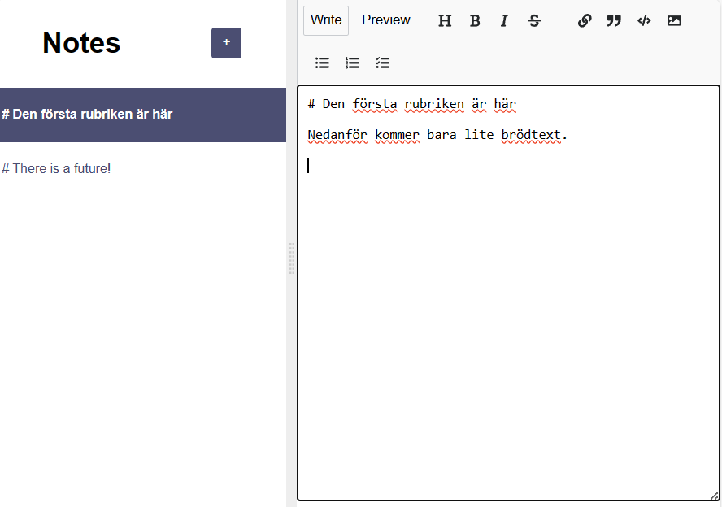

# Notes App

## Description
A basic site presenting some facts about React. The page consists of two React components (Navbar and Main) which appearances could be toggled between Light and Dark mode, using the toggle switch at the upper right corner. Se pictures below.
 
 

## Technologies
- HTML
- CSS
- JavaScript
- React

## Live link
The app is deployed here:
[https://markup-notes.netlify.app](https://markup-notes.netlify.app)

Please feel free to play around with the app!
